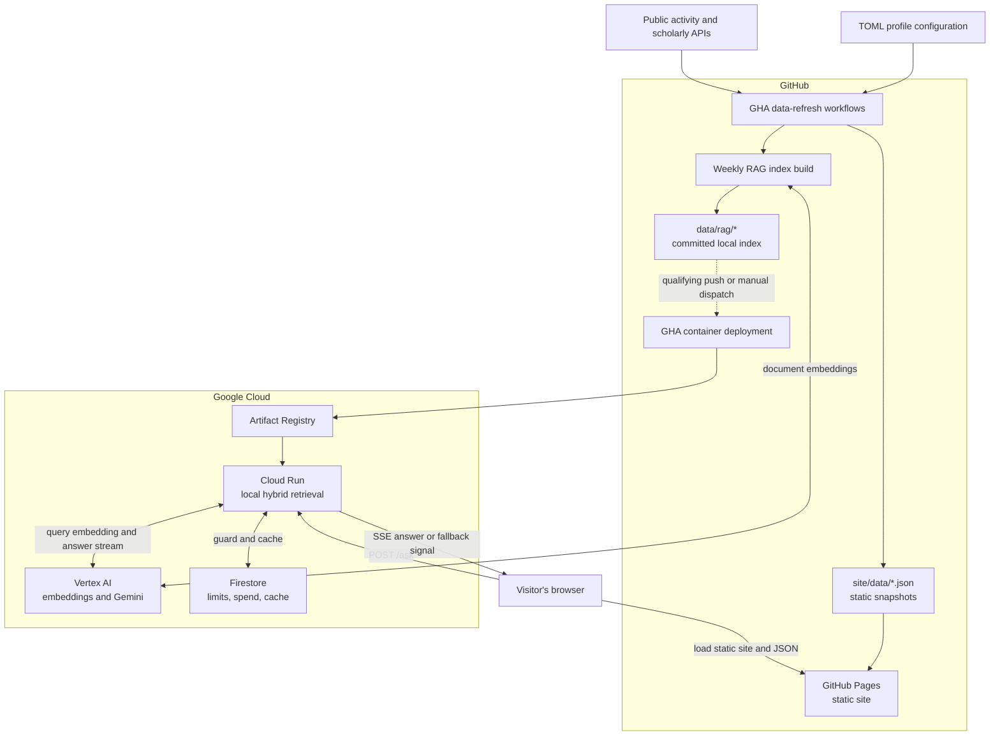
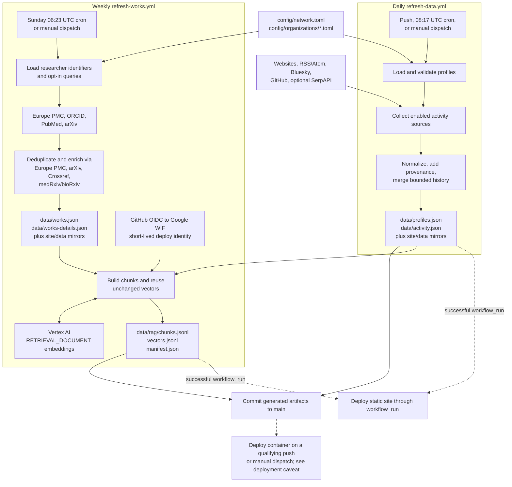
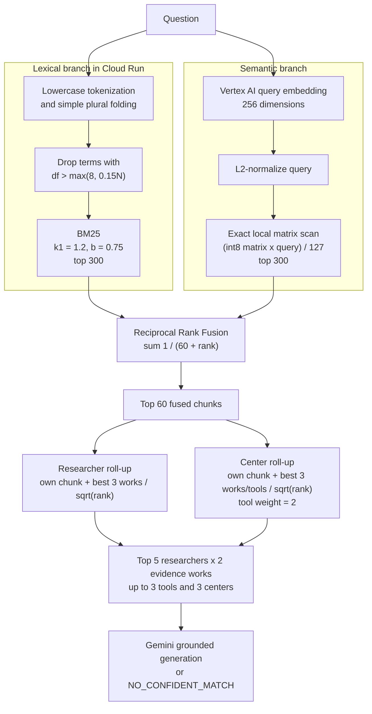
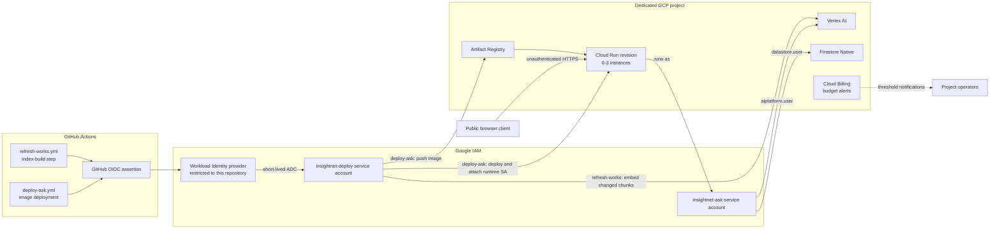
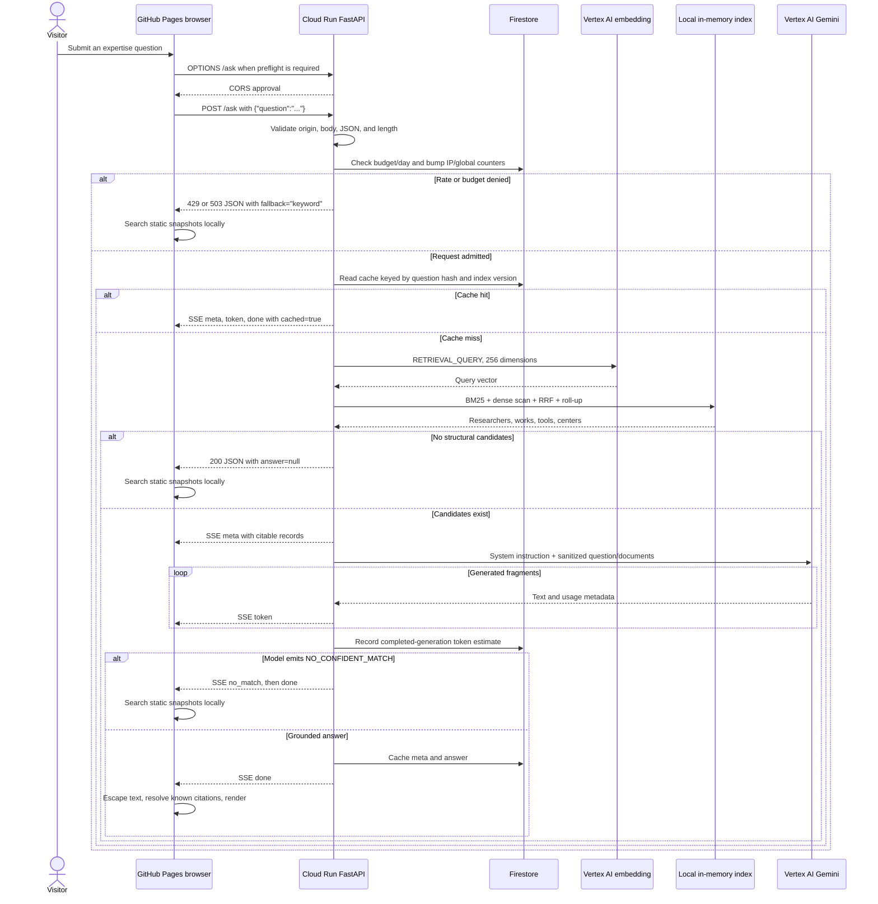

# How InsightNet's RAG system works

InsightNet has two connected systems:

1. an **offline publishing pipeline** that turns version-controlled profiles and public
   scholarly metadata into JSON snapshots and a retrieval index; and
2. a **runtime question-answering service** that embeds a visitor's question, searches that
   index inside Cloud Run, and asks Gemini to write a short answer grounded in the retrieved
   records.

The most important architectural fact is that this repository does **not** use FAISS, Vertex AI
Vector Search, Firestore vector search, or another hosted vector database. The complete index is
committed under [`data/rag/`](../data/rag/), copied into the container image, and scanned in memory
by the Python service. Google Cloud supplies compute, identity, embeddings, generation, and a small
Firestore ledger; it does not host the retrieval corpus separately.

This document uses **GHA** for GitHub Actions and **GCP** for Google Cloud Platform. There is no
Google Cloud Messaging (GCM) component in this project.

## System overview



There are three deliberately different data paths:

- **Static site data** is copied into `site/data/` and served by GitHub Pages.
- **RAG data** stays in `data/rag/`; the browser never downloads it.
- **Runtime state** such as counters and cached answers lives in Firestore; it is not part of the
  scientific corpus.

## 1. From profile configuration to published data

### Configuration is the source of truth

Shared network settings live in [`config/network.toml`](../config/network.toml). Each center owns
one file in [`config/organizations/`](../config/organizations/), containing some or all of:

- center metadata and focus areas;
- researchers, biographies, expertise, and scholarly identifiers;
- tools and products;
- health partners; and
- optional public activity sources.

[`insightnet/config.py`](../insightnet/config.py) reads the files in a stable order, supplies
defaults, validates IDs and HTTP(S) URLs, derives safe profile links from ORCID, filters disabled
centers, and rejects duplicate identifiers. The settings that materially affect the generated
corpus are:

| Setting | Default | Effect |
| --- | ---: | --- |
| `retention_days` | 730 | Activity history retained by the daily pipeline |
| `max_items_per_organization` | 1,000 | Maximum retained activity records per center |
| `max_works_per_researcher` | 100 | Per-researcher selection cap before retained works are unioned |
| `works_retention_years` | 15 | Publication-history window |
| `abstract_max_chars` | 1,500 | Abstract stored by the works pipeline before RAG truncation |

The first two are explicit in `network.toml`; the other three currently come from loader defaults.
Because the works pipeline keeps the union of every researcher's selected works, a shared paper
retained for one coauthor can leave another researcher linked to more than 100 final records; the
value is a selection cap, not a post-union hard limit.

For publications, attribution is identifier-first. ORCID is the default identifier for Europe
PMC, ORCID, and PubMed; an explicit `pubmed_query` overrides the PubMed identifier query, while
arXiv collection is opt-in through `arxiv_query`. Explicit queries avoid silently inventing a
name search and let maintainers disambiguate researchers when necessary.

### Offline collection and index build



### Daily profiles and activity

[`refresh-data.yml`](../.github/workflows/refresh-data.yml) restores the locked `uv` environment,
runs the test suite, then runs `insightnet-update`. The command:

1. loads the TOML profiles;
2. calls every enabled activity collector independently;
3. records a health row even when one source is blocked or errors;
4. merges new records into retained history;
5. atomically writes `profiles.json` and `activity.json`; and
6. mirrors both files into `site/data/`.

Website, RSS/Atom, Bluesky, GitHub, and optional Google Scholar-through-SerpAPI collectors are
implemented in [`insightnet/collectors.py`](../insightnet/collectors.py). LinkedIn and X/Twitter are
profile links only unless an approved API or RSS bridge is added. `GITHUB_TOKEN` is provided by
Actions; `SERPAPI_API_KEY` is optional.

At the time this document was written, no organization TOML file configured an
`[[organization.sources]]` block or a `scholar_author_id`. Consequently, the current activity
snapshot is empty. The daily framework is operational; scholarly works plus the version-controlled
researcher, organization, and tool profiles are the active RAG evidence.

### Weekly scholarly works

[`refresh-works.yml`](../.github/workflows/refresh-works.yml) collects publications on Sunday and
on manual dispatch. For each eligible researcher, configured identifiers enable up to four primary
sources, and each enabled collector runs independently:

| Source | Query basis | Main contribution |
| --- | --- | --- |
| Europe PMC | ORCID | Rich biomedical metadata, abstracts, keywords, coauthors |
| ORCID | ORCID | Researcher-claimed work summaries and identifiers |
| PubMed | ORCID or explicit `pubmed_query` | Abstracts, MeSH terms, coauthors, PMID and DOI |
| arXiv | Explicit `arxiv_query` | Preprint abstracts, subjects, and authors |

Records are recognized by DOI, then PMID, then arXiv ID, then normalized title. After records are
merged across researchers, sparse works are enriched once—not once per coauthor—using Europe PMC,
arXiv, the medRxiv/bioRxiv API, and Crossref. Failures in a researcher's enabled primary collectors
produce source-health rows without discarding successful records from other sources. Enrichment
is best-effort: failures are skipped, and the output reports only enrichment success counts.

The workflow writes a lightweight `works.json` and a separate `works-details.json`. The latter
contains abstracts and ordered coauthor lists capped at 200 authors, which are large and loaded
lazily by the site. The RAG builder recombines both documents so it can use abstract text.

Manual workflow controls are intentionally independent:

- `replace`: discard retained works before collection;
- `rebuild_index`: force every chunk to be embedded again; and
- `skip_collection`: keep the existing works and rebuild only the RAG index.

The RAG build is a **step inside this weekly workflow**, not a separate refresh workflow. After
collection, GHA exchanges its OIDC assertion through Google Workload Identity Federation (WIF),
runs `insightnet-rag`, runs the test suite after the rebuild, and commits the works and index
together. The tests use fixture indexes in temporary directories; they do not currently reopen and
integrity-check the newly committed `data/rag/` artifacts.

The builder consumes the last generated `data/profiles.json` alongside `works.json` and
`works-details.json`; it does not reload the TOML profiles directly during the RAG step. That is
why profile-snapshot freshness is recorded in the index manifest.

### Published data contracts

| Artifact | Built from | Consumer |
| --- | --- | --- |
| `data/profiles.json` | TOML profiles plus daily source health | RAG builder and repository users |
| `data/activity.json` | Optional daily activity collectors | Static site's activity/search views |
| `data/works.json` | Weekly scholarly collection | Static site and RAG builder |
| `data/works-details.json` | Abstracts and ordered coauthors | Static site and RAG builder |
| `site/data/*.json` | Mirrors of the four documents above | Visitor's browser |
| `data/rag/chunks.jsonl` | Profiles, works, and work details | Cloud Run retrieval service |
| `data/rag/vectors.jsonl` | Vertex document embeddings | Cloud Run retrieval service |
| `data/rag/manifest.json` | Index format, counts, model, source timestamps | Startup validation, cache versioning, operators |

The daily and weekly products have separate freshness. A profile edit may appear on GitHub Pages
before it appears in Ask InsightNet. The RAG manifest records the exact `profiles_generated_at`
and `works_generated_at` values used to build it, so [`manifest.json`](../data/rag/manifest.json) is
the authoritative provenance record for the **committed** index. Because index deployment is
separate, `/readyz` or the SSE `indexGeneratedAt` field is authoritative for the Cloud Run revision
that is actually serving visitors.

## 2. How the RAG index is built

The implementation is shared by the offline builder and runtime server in
[`insightnet/rag.py`](../insightnet/rag.py). This prevents the local `insightnet-rag --query`
ranking from drifting away from production ranking.

### One flat corpus, four chunk kinds

The committed manifest generated on 2026-08-04 reports 7,980 chunks and 7,980 vectors:

| Kind | Current count | Stable ID | Text used for embedding and BM25 |
| --- | ---: | --- | --- |
| Work | 7,425 | `w:<work-id>` | Title, venue/year, keywords, first 480 abstract characters, first 6 authors |
| Researcher | 471 | `r:<researcher-id>` | Name, role/center, bio, expertise, 15 work-derived topics, 8 newest work titles |
| Tool | 71 | `t:<tool-id>` | Name, category/status, center, summary, keywords |
| Organization | 13 | `o:<organization-id>` | Name/acronym, summary, focus areas, keywords |

There is no fixed-token sliding window and no recursive splitting: one work is one chunk. Although
the works pipeline may retain 1,500 abstract characters, the current work chunk embeds only the
480-character prompt snippet. `EMBED_TEXT_LIMIT = 8000` is a **character** safety cap on a composed
record, not an embedding-token target.

Partners and activity records are not indexed. That is a scope decision: Ask InsightNet answers
which researchers or centers can help with a topic. The deterministic browser search still covers
partners and activity.

### Why researcher chunks include publication-derived text

The design was measured against the real profile corpus. At implementation time, 471 bios averaged
about 160 characters and used generic institutional language. “ERGM” appeared zero times in bios
but three times in publication titles; “Ebola” appeared once in bios and 54 times in titles;
“Bayesian” appeared once versus 49 times. Only a minority of researchers supplied useful expertise
tags.

A profile-only embedding therefore could not find many specialists. Each researcher chunk instead
adds the 15 most frequent topics extracted from all of that person's work titles/keywords and the
titles of their 8 newest works. The repeated “this bio was AI-generated” suffix is removed from the
index but remains visible in the profile snapshot.

### Sanitization boundary

Publication text is public and potentially adversarial. Before hashing, embedding, or prompting,
the builder:

- cleans HTML and whitespace;
- removes C0 control and Unicode format characters;
- strips `<` and `>` so a paper cannot forge prompt document tags;
- caps snippets at 480 characters; and
- truncates the final composed embedding text at 8,000 characters.

The server sanitizes the text again while rendering the prompt. Tests verify that a title or
abstract cannot create a fake `</document>` or `</documents>` boundary.

### Incremental rebuild

For each composed chunk text `x`, the builder stores a 64-bit truncated content hash:

$$
h(x) = \mathrm{SHA256}(x)[0:16]
$$

where `[0:16]` means the first 16 hexadecimal characters. During a normal rebuild:

1. same ID and same hash: copy the previous base64 vector byte-for-byte;
2. new or changed chunk: call Vertex AI;
3. disappeared chunk: omit it from the new sorted files; and
4. write compact, ID-sorted JSONL so Git sees small diffs.

`--dry-run` reports how many chunks would be embedded without calling Google. `--replace` forces a
full rebuild.

One important limitation: vector reuse checks the chunk ID and text hash, but not the previous
model or dimension. Always use `--replace` when changing `INSIGHTNET_EMBED_MODEL`, `--model`, or
`--dims`, and keep the runtime `INSIGHTNET_EMBED_*` settings aligned with the manifest.

### Embedding, normalization, and quantization

Document chunks use Vertex AI model `gemini-embedding-001` with:

- `task_type = "RETRIEVAL_DOCUMENT"`;
- `output_dimensionality = 256`; and
- build batches of 100 texts.

Live questions use the same model and dimension with `RETRIEVAL_QUERY`. The different task types
are intentional; using the document task for a question is a silent retrieval-quality loss rather
than an API error.

The model's full vector is 3,072-dimensional, but the repository requests a 256-dimensional
Matryoshka prefix to make the committed file and exact runtime scan small. The repository does not
contain a dimension-ablation benchmark proving that 256 is optimal; it is an operating choice.
For the current corpus, the raw int8 matrix is only:

$$
7{,}980 \times 256 = 2{,}042{,}880\text{ bytes} \approx 1.95\text{ MiB}.
$$

Google's current [Gemini embedding documentation](https://ai.google.dev/gemini-api/docs/embeddings)
also explains why the code normalizes a truncated `gemini-embedding-001` vector manually. Given a
vector $v$:

$$
\lVert v\rVert_2 = \sqrt{\sum_{i=1}^{D}v_i^2}, \qquad
\hat v_i = \frac{v_i}{\lVert v\rVert_2}.
$$

The zero vector is mapped to zeros. Each unit component is then quantized to a signed byte:

$$
q_i = \mathrm{clamp}\left(\mathrm{round}(127\hat v_i), -127, 127\right).
$$

The 256 bytes are base64-encoded in `vectors.jsonl`. At query time, dense similarity is:

$$
s_{\text{dense}}(d,Q)
= \sum_i \frac{q_{d,i}}{127}\hat v_{Q,i}
\approx \cos(v_d,v_Q).
$$

The quantization regression test checks that the dot product between the dequantized vector and
the original unit vector is within 0.01 of 1. It does not renormalize the reconstructed vector, so
that assertion is a quantization-quality proxy rather than a separately computed cosine.

### Index files

- `chunks.jsonl` is the readable structured corpus and content hashes.
- `vectors.jsonl` contains `{ "id": ..., "v": ... }` records with base64 int8 vectors.
- `manifest.json` records schema version, build time, model, dimensions, quantizer, scale, counts,
  and source snapshot timestamps.

The manifest does not currently contain checksums. Each file is written atomically, but the three
files are replaced one after another rather than as one filesystem transaction.

Startup validation is intentionally light: `Index.load()` checks the schema version but does not
verify exact vector/chunk ID equality, the declared vector count, quantizer or scale compatibility,
the embedding model, or the runtime embedding dimension. The deployment workflow only verifies
that the chunk and vector files are nonempty. A future artifact-validation step should close this
gap; until then, use `--replace`, inspect the manifest, and test a deployed query when changing the
embedding configuration.

## 3. Query-time retrieval and its mathematics



When the service loads the index, it creates a chunk-ID lookup, token-frequency maps, document
frequencies, document lengths, and average document length. The int8 NumPy matrix is assembled
lazily on the first dense query. There are no committed postings lists and no approximate nearest
neighbor structure.

### Lexical preprocessing

Both documents and questions are lowercased and tokenized with:

```text
[a-z0-9][a-z0-9-]*
```

A small plural fold maps words such as `dashboards` to `dashboard`, while preserving endings such
as `analysis`, `virus`, and `bias`. BM25 then deduplicates the query terms.

A term is ignored when its document frequency is too high:

$$
df_t > \max(8, 0.15N).
$$

At the current $N=7{,}980$, that is more than 1,197 documents. This corpus-derived rule removes
high-frequency corpus terms such as “health” and “disease”; it is not a conventional stop-word
list. The absolute floor of 8 prevents a tiny development corpus from treating every term as
common.

### BM25

For a term $t$, document $d$, and corpus of $N$ chunks:

$$
\mathrm{idf}(t)
= \ln\left(1 + \frac{N-df_t+0.5}{df_t+0.5}\right)
$$

and:

$$
\mathrm{BM25}(d,Q)
= \sum_{t\in\mathrm{unique}(Q)}
\mathrm{idf}(t)
\frac{f_{t,d}(k_1+1)}
{f_{t,d}+k_1\left(1-b+b\frac{|d|}{\overline{|d|}}\right)}
$$

with $k_1=1.2$ and $b=0.75$. The top 300 lexical chunks continue to fusion. This branch is what
preserves rare exact acronyms such as ERGM, SEIR, and MRSA that a semantic embedding can blur into
a broader topic.

### Exact dense scan

The normalized query vector is multiplied by every dequantized document direction. With $N$ chunks
and $D=256$ dimensions, complexity is $O(ND)$—about two million component multiplications for the
current index. NumPy performs:

```python
(matrix.astype(float32) @ query.astype(float32)) / 127
```

and keeps the top 300. A pure-Python scan exists when NumPy is unavailable.

The dense-ranking result stores the top score, distribution mean $\mu$, and population standard
deviation $\sigma$:

$$
\mu=\frac{1}{N}\sum_i s_i, \qquad
\sigma=\sqrt{\frac{1}{N}\sum_i(s_i-\mu)^2}.
$$

The `DenseRanking.contrast` property can derive
$z_{\text{top}}=(s_{\text{top}}-\mu)/\sigma$, but the current search path never reads that property.
Only $\sigma$, exposed as `spread`, reaches response metadata. It is diagnostic, not a confidence
gate; the z-scores in the calibration table below were calculated during analysis rather than
returned by live retrieval.

### Reciprocal Rank Fusion

BM25 and cosine scores have different units and ranges. Rather than fit a weighted sum on a small
unlabeled corpus, the system combines their rank positions:

$$
\mathrm{RRF}(d)
= \sum_{L\in\{\text{BM25},\text{dense}\}}
\frac{1}{60+\mathrm{rank}_L(d)},
$$

where rank is one-based. Each branch contributes at most once per chunk. Up to 600 unique chunks
can enter the union; only the top 60 fused chunks feed entity roll-up.

### Researcher and center roll-up

Publication volume is highly uneven, so simply summing every matching paper would favor prolific
authors. A researcher receives their own researcher-chunk score plus only their best three work
scores, with within-person rank decay:

$$
S(p)=F(r_p)+\sum_{j=1}^{\min(3,m_p)}\frac{F(w_{p,j})}{\sqrt{j}}.
$$

Every listed network coauthor receives full credit because coauthorship is evidence, not a duplicate
to split fractionally. The best-three cap is the main fairness control; a test with 40 weakly
matching papers versus 3 specialist papers protects it. The result contains the top 5 researchers
and at most 2 evidence works for each.

Centers use the same best-three decay, but a tool match has weight 2 while a publication has weight
1:

$$
S(o)=F(o_o)+\sum_{j=1}^{\min(3,m_o)}
\frac{\alpha(e_j)F(e_j)}{\sqrt{j}},
\qquad
\alpha(e)=
\begin{cases}
2,&e\text{ is a tool},\\
1,&e\text{ is a work}.
\end{cases}
$$

This encodes a qualitative decision: shipping a tool is a more specific and current signal of a
center's capability than a broad historical publication match. It also lets “who can build a
dashboard?” resolve honestly to a team when the tool has no individual owner. Up to 3 matching
tools and 3 centers continue to the prompt. The factor of 2 applies only while rolling tool
evidence into a center's score; returned tools keep their raw fused scores and are not doubled or
re-ranked with this factor.

### Parameter summary

| Stage | Parameter | Value |
| --- | --- | ---: |
| Chunking | Abstract snippet | 480 characters |
| Chunking | Final composed-text cap | 8,000 characters |
| Researcher synthesis | Work-derived topics | 15 |
| Researcher synthesis | Recent work titles | 8 |
| Work chunks | Named authors | 6 |
| Embedding | Model | `gemini-embedding-001` |
| Embedding | Dimensions | 256 |
| Embedding | Builder batch | 100 chunks |
| Lexical | BM25 $k_1$, $b$ | 1.2, 0.75 |
| Lexical | Common-term cutoff | `max(8, 15% of N)` documents |
| Candidate generation | Per retrieval branch | 300 |
| Fusion | RRF constant | 60 |
| Roll-up | Fused pool | 60 chunks |
| Roll-up | Evidence contributing per researcher/center | 3 |
| Result | Researchers / evidence each | 5 / 2 |
| Result | Tools / centers | 3 / 3 |
| Prompt | Retrieved-document blocks | 14,000 characters, plus delimiters |
| Generation | Model | `gemini-2.5-flash-lite` |
| Generation | Temperature | 0.2 |
| Generation | Maximum output | 512 tokens |
| Generation | Thinking budget | 0 |
| Generation | Prose limit in instruction | 180 words |

The repository contains strong rationale and regression coverage for hybrid retrieval, the
best-three cap, common-term filtering, RRF, tool weight, task types, normalization, researcher
synthesis, and the lack of a numerical threshold. Values such as 256 dimensions, top 300, RRF 60,
and a 480-character snippet are chosen operating parameters; they have not each been optimized by
a committed ablation study.

### What “confidence” means and what was measured

There is deliberately no numeric relevance threshold. During implementation, five signals were
measured on 12 on-topic and 12 off-topic questions against the real index:

| Signal | On-topic range | Off-topic range | Clean separation? |
| --- | ---: | ---: | --- |
| Top cosine | 0.68–0.79 | 0.66–0.69 | No |
| Top minus mean | 0.112–0.156 | 0.083–0.143 | No |
| Top z-score | 3.27–4.44 | 3.45–5.07 | No |
| Score standard deviation | 0.0315–0.0397 | 0.0236–0.0282 | Only for full sentences |
| Top BM25 | 10.4–15.1 | 4.4–20.1 | No |

The standard-deviation rule looked promising until short, valid queries were tried: `dashboard`
scored 0.019 and `ERGM` 0.031 despite finding the right records. Conversely, an unrelated World
Cup question reached BM25 20.1 because its individual words existed somewhere in the corpus.

As a result, `Retrieval.confident = true` means only that a structurally usable candidate set
exists. It does **not** mean that the question is semantically in scope. Gemini receives the
question and records and must answer with the exact sentinel `NO_CONFIDENT_MATCH` when the question
is off-domain or the documents do not support an answer. The server buffers the beginning of the
model stream so this sentinel is never shown as prose.

This is calibration and behavioral regression coverage, not a formal retrieval benchmark. There
is no committed labeled query set and no reported Precision@k, Recall@k, MRR, or NDCG. Current tests
instead protect planted-expert ranking, acronym retrieval, prolific-author fairness, plural
folding, common-term filtering, tool-to-center attribution, RRF, prompt sanitization, and
quantization error. Recalibrate before changing the embedding model, dimension, corpus, or
threshold policy.

## 4. Google Cloud deployment and identity



### Services and responsibilities

| Google service | Responsibility | Not used for |
| --- | --- | --- |
| Vertex AI | Offline document embeddings, live query embeddings, streamed Gemini answers | Storing or searching the corpus |
| Artifact Registry | Docker images tagged by Git SHA | Per-query data access |
| Cloud Run | Public FastAPI service and local in-memory retrieval | Offline collection |
| Firestore Native | Cross-instance counters, spend ledger, successful-answer cache | Vector search or source documents |
| IAM, STS, WIF | Short-lived CI credentials and runtime service identity | End-user login |
| Cloud Billing budget | Billing threshold alerts; console settings may add a spend cap | Guaranteed application shutdown |

Cloud Build and Cloud Storage are deliberately absent. The image is built on the GitHub runner and
pushed directly to Artifact Registry, avoiding a Cloud Build staging bucket and the extra storage
and service-usage permissions it would require.

### Two least-privilege identities

Terraform defines two service accounts:

| Identity | Used by | Roles |
| --- | --- | --- |
| `insightnet-deploy` | GHA index build and deployment | Cloud Run admin, Vertex AI user, Artifact Registry writer, and service-account user on the runtime identity |
| `insightnet-ask` | Running Cloud Run revision | Vertex AI user and Datastore/Firestore user |

GitHub mints a short-lived OIDC assertion. Google's WIF provider accepts only the configured
repository claim and permits that principal to impersonate `insightnet-deploy`. No long-lived
service-account JSON key is created or stored. In Cloud Run, `google-genai` and the Firestore client
obtain Application Default Credentials from `insightnet-ask`.

The service is public because the static site has no user login. CORS restricts ordinary browser
use to exact configured origins, but CORS is not authentication; missing `Origin` is accepted for
curl and probes. Application rate and budget controls are the real perimeter.

### Container and Cloud Run shape

[`Dockerfile`](../Dockerfile) installs the server dependencies, copies `insightnet/`, `server/`,
and `data/rag/`, then starts Uvicorn. Therefore:

- a cold start performs no network fetch to load the index;
- the retrieval code and index ship in the same revision;
- `/readyz` reports the loaded chunk count and index timestamp; and
- a new index becomes live only when an image containing it is deployed.

`/readyz` checks local application construction and index loading only. The Vertex clients are
lazy and the endpoint does not call Vertex or Firestore, so a ready response does not prove that
runtime credentials or either upstream service are usable.

[`deploy-ask.yml`](../.github/workflows/deploy-ask.yml) refuses to build if chunks or vectors are
missing, builds and pushes the image, and deploys Cloud Run with:

- 0 minimum and 3 maximum instances;
- concurrency 8;
- 1 CPU and 1 GiB memory;
- a 60-second request timeout; and
- startup CPU boost.

It finishes by fetching `/readyz` from the deployed URL.

### Deployment-trigger caveat

The deployment workflow listens for qualifying pushes to `main` and for manual dispatch. However,
the weekly refresh commits and pushes with the repository's built-in `GITHUB_TOKEN`. GitHub's
[workflow-trigger documentation](https://docs.github.com/en/actions/how-tos/write-workflows/choose-when-workflows-run/trigger-a-workflow)
states that a push made with `GITHUB_TOKEN` does not create another workflow run. Consequently, the
weekly RAG commit does **not** by itself start the push-triggered `deploy-ask.yml` workflow.

Today, deploy the new index manually, make a qualifying push that itself changes one of
`deploy-ask.yml`'s watched paths, or authenticate the RAG-producing push with an appropriate GitHub
App or PAT. A later unrelated push will not pass the workflow's path filter. A future workflow
change could call a reusable deployment job directly or issue `workflow_dispatch`/
`repository_dispatch`. GitHub Pages does not have this gap: `deploy-pages.yml` explicitly listens
for successful completion of both refresh workflows through `workflow_run`.

The reproducible GCP setup is in [`infra/terraform/`](../infra/terraform/). Terraform creates the
APIs, identities, WIF trust, Artifact Registry, Firestore, Cloud Run shape, public-invoker policy,
and billing budget; it does not create the project, link billing, build images, or embed the index.
The organization-policy exception permits public IAM members across the dedicated project, not just
this service, which is why the infrastructure is isolated from unrelated workloads.

## 5. What happens when a visitor submits a query



### Browser request

Both Ask forms call `askQuestion()` in [`site/assets/app.js`](../site/assets/app.js). The browser
cancels a previous in-flight question, switches to the Ask view, and sends one JSON object:

```http
POST https://insightnet-ask-ckn3l2i5pq-uc.a.run.app/ask
Origin: https://epiforesite.github.io
Content-Type: application/json

{"question":"which researchers have worked with Ebola?"}
```

There is no conversation history, session ID, user ID, model choice, temperature, or retrieval
option in the request. This is single-turn expert finding, not a general chatbot. The body is capped
at 2,048 bytes and the trimmed question must contain 3–300 characters. The route expects JSON but
parses the raw body; it does not independently reject a misleading `Content-Type` header. This is a
conventional rather than strict JSON schema: the implementation applies `str()` to the `question`
value, so non-string scalars such as numbers, booleans, or `null` can pass if their converted text
meets the length rule.

Because this is a cross-origin JSON POST, a browser normally sends an `OPTIONS` preflight. FastAPI's
CORS middleware permits only configured origins, `POST`/`OPTIONS`, and the `content-type` request
header.

### Admission, rate limits, and cache

`POST /ask` performs these checks in order:

1. exact `Origin` allowlist when an Origin is present;
2. declared and actual body size;
3. JSON shape and question length;
4. monthly application budget and global daily cap;
5. per-IP minute/day counters, then the global query counter;
6. successful-answer cache;
7. query embedding;
8. local retrieval; and
9. Gemini generation.

Defaults from [`server/config.py`](../server/config.py):

| Control | Default | Result when exceeded |
| --- | ---: | --- |
| One IP per minute | 5 | HTTP 429 with keyword fallback |
| One IP per day | 40 | HTTP 429 with keyword fallback |
| All queries per day | 400 | HTTP 503 with keyword fallback |
| Recorded completed-generation token estimate | 5,000,000 microdollars = $5/month | Subsequent admission gets HTTP 503 with keyword fallback |
| Cache expiry metadata | 7 days | Enforced by `MemoryLedger`; production requires a Firestore TTL policy |

The counted address is read from the *right* of `X-Forwarded-For`, because Cloud Run appends the
connecting address to whatever the caller sent; the leftmost entry is caller-supplied and was
previously usable to land in a fresh bucket on every request. `TRUSTED_PROXIES` (comma-separated IPs
or CIDRs, empty by default) names hops to look through when the service runs behind an additional
proxy that appends an entry of its own. A forged entry always sits to the left of the address the
platform appended, so naming trusted hops — rather than counting them — keeps the selection safe
even while direct ingress to the service URL stays open. That address is then salted, SHA-256
hashed, and truncated before storage; raw IP addresses are not written by application code. This privacy property depends on setting a secret
`IP_SALT`: if it is absent, production uses the published `insightnet` default and logs only a
warning, making hashes of the small IPv4 space susceptible to dictionary recovery. Counters are
incremented before expensive model work so a crash cannot create an uncounted query. Firestore uses
atomic increments followed by reads rather than a transaction, so concurrently racing instances
can overshoot a limit by a small number of requests.

The answer-cache key is:

$$
\mathrm{SHA256}(\mathrm{normalize}(question)\;\Vert\;"|"\;\Vert\;
manifest.generated\_at)[0:40].
$$

Deploying an image with a newly generated index timestamp makes earlier cache keys unreachable. A
hit skips both the query-embedding and generation calls, but cache lookup occurs after every guard
check: an exhausted monthly/global/IP limit prevents even a cached answer from being replayed, and
an admitted cache hit still counts toward the IP and global request limits. Refusals are not
cached.

`FirestoreLedger.cache_get()` does not inspect `expires_at`; production expiry relies on an
external Firestore TTL policy, whose deletion is asynchronous. Terraform does not configure that
policy, so without it a cached answer remains readable until an index deployment changes the cache
key. The in-memory development ledger does enforce the timestamp itself.

### Query embedding and retrieval

On a cache miss, Cloud Run calls Vertex AI once to embed the question as a 256-dimensional
`RETRIEVAL_QUERY`. Cloud Run then performs BM25, dense similarity, RRF, and both roll-ups entirely
inside the process. Neither Firestore nor Vertex searches the corpus.

If there is no structurally usable candidate set, the service returns normal JSON:

```json
{"answer": null, "reason": "no_match"}
```

With a query vector and a nonempty production index, dense retrieval normally supplies candidates;
semantic refusal is therefore usually the generation model's responsibility.

### Prompt sent to Gemini

The generation call has two parts:

1. a constant system instruction that defines InsightNet's domain, grounding rules, citation
   format, and refusal sentinel; and
2. a user-content string containing the sanitized question and retrieved records.

The user content resembles:

```xml
<question>which researchers have worked with Ebola?</question>

<documents>
  <document id="r:researcher-id" kind="researcher" name="..." role="...">
    ...profile and publication-derived summary...
  </document>
  <document id="w:work-id" kind="work" researchers="..." year="2024" venue="...">
    <title>...</title>
    <abstract>...480-character snippet...</abstract>
  </document>
  <document id="t:tool-id" kind="tool" built_by="..." category="dashboard">
    <name>...</name>
    <summary>...</summary>
  </document>
  <document id="o:center-id" kind="center" name="...">
    <name>...</name>
  </document>
</documents>
```

The sum of retrieved document blocks is capped at 14,000 characters; the `<documents>` wrapper and
inter-block newlines are added afterward, so the rendered document section is slightly larger. The
system instruction requires two to four researchers when people are the supported answer, allows
a center/tool answer when no individual owns the capability, requires exact citation markers such
as `[[w:work-id]]`, forbids unsupported names or affiliations, and limits prose to 180 words.

[`server/main.py`](../server/main.py) calls `gemini-2.5-flash-lite` through Vertex AI with
temperature 0.2, at most 512 output tokens, and `thinking_budget = 0`. Thinking is deliberately
disabled for this short extraction-and-synthesis task. The model name and price assumptions can be
changed with environment variables without rebuilding the image.

### Stream returned to the browser

The response is Server-Sent Events (SSE) over the POST response. Metadata arrives before prose:

```text
event: meta
data: {"citations":[{"id":"w:abc123","kind":"work","work_id":"abc123","title":"..."}],"researchers":[...],"tools":[...],"organizations":[...],"indexGeneratedAt":"...","spread":0.03125,"cached":false}

event: token
data: {"t":"Dr. Example's work supports this fit "}

event: token
data: {"t":"[[w:abc123]]."}

event: done
data: {"inputTokens":1830,"outputTokens":92}
```

The response uses `Content-Type: text/event-stream`, `Cache-Control: no-store`, and
`X-Accel-Buffering: no` so intermediaries do not cache or batch the stream.

`meta.citations` is assembled from the full retrieval—works, researchers, tools, and centers—so it
contains every record Gemini can cite and may also contain records omitted when prompt rendering
hits the 14,000-character block cap. Every valid marker is therefore resolvable without another
request, but metadata membership alone does not prove that a record reached Gemini. A cache hit
replays one complete `token` event and reports `cached: true` with zero token usage.

The browser accumulates token text and repaints at most once every 80 ms. It HTML-escapes the whole
answer first, replaces only exact markers from `meta.citations` with numbered links, and removes
unknown markers. A model-invented URL or citation ID therefore cannot become an active link.

If Gemini begins emitting `NO_CONFIDENT_MATCH`, the server holds those opening characters until it
can recognize the sentinel. It then sends `no_match` and `done`, without exposing the sentinel as
answer text.

### Failure and fallback behavior

| Condition | Service response | Site behavior |
| --- | --- | --- |
| Foreign browser origin | Browser preflight: 400/CORS fetch failure; direct POST reaching the route: 403 `forbidden_origin` | Local keyword fallback |
| Body over 2 KiB | 413 `payload_too_large` | Local keyword fallback |
| Bad JSON or missing `question` | 400 `bad_request` | Visible input error |
| Question outside 3–300 characters | 422 `bad_request` | Visible input error |
| IP rate limit | 429 `rate_limited` | Local keyword fallback |
| Daily or monthly cap | 503 `budget_exhausted` | Local keyword fallback |
| Query-embedding failure | 503 `upstream_unavailable` | Local keyword fallback |
| Empty retrieval | 200 JSON with `answer: null` | Local keyword fallback |
| Gemini refusal | SSE `no_match`, then `done` | Clear assisted answer and fall back |
| Generation failure mid-stream | SSE `error` | Clear partial answer/citations and fall back |
| Firestore guard/cache failure | Generic 500 before streaming, or an aborted stream after tokens | Local keyword fallback on the browser's fetch/stream error |
| Browser/network failure | Fetch error | Local keyword fallback |

The fallback loads the static works/details files and runs the existing `searchExperts()` across
profiles, publications, centers, tools, partners, and activity. Its matching is lexical, uses AND
substring semantics, and happens entirely in the browser. One current edge case is that assisted
questions allow 300 characters while `keywordTerms()` allows 120; a 121–300-character question can
therefore fail inside the fallback path.

### Spend accounting

After a generation completes, the server estimates its cost from the reported
`prompt_token_count`, `candidates_token_count`, and any thinking tokens. With prices expressed as
microdollars per million tokens:

$$
\text{charge}_{\mu\$}
= \mathrm{round}\left(
\frac{T_{in}P_{in}}{10^6}
+ \frac{T_{out}P_{out}}{10^6}
\right).
$$

The configured defaults are 100,000 microdollars per million input tokens and 400,000 per million
output tokens. They are operational assumptions, not a promise of current Vertex pricing; verify
them before deployment.

This ledger is a best-effort operational ceiling, not a complete GCP bill or an atomic hard cap. It
counts only completed Gemini generations; it excludes query and document embeddings, Firestore,
Cloud Run, Artifact Registry, networking, and other charges. A failed or interrupted generation
returns before spend is recorded, while concurrent requests can all pass admission before their
later writes take the total beyond $5. Once the recorded estimate reaches the configured value,
subsequent guard checks reject requests.

Terraform's separate Cloud Billing budget defaults to $10 and defines threshold alerts. Whether a
budget also stops spend is an external console setting that this repository does not control; see
Google's [Cloud Billing budget documentation](https://docs.cloud.google.com/billing/docs/how-to/budgets).
It is therefore not a guaranteed shutdown mechanism. `--max-instances=3` is an additional
infrastructure ceiling.

### What is and is not persisted

Application code does not store the raw question or raw IP address in Firestore, subject to using a
non-default secret `IP_SALT` for meaningful IP-hash privacy:

- the question contributes to an index-versioned SHA-256 cache key;
- a successful cache value contains only `{meta, answer}`;
- the IP contributes to a salted rate-limit hash; and
- retrieved records are not persisted in Firestore; selected blocks leave the image only in the
  generation request to Vertex AI.

The raw question is sent from Cloud Run to Vertex AI for the embedding call. Separately, the
sanitized question plus retrieved document blocks are sent for Gemini generation. The browser
discloses this on the Ask view. Consult the applicable Google Cloud data-governance settings and
terms for processing outside this repository's code.

Firestore records include an `expires_at` field, but the Terraform in this repository does not
configure a Firestore TTL policy. The production cache reader also does not reject an expired
timestamp itself, so configure the policy separately for expiry and automatic cleanup.

## 6. Security model

This section describes security properties visible in the repository; it is not a penetration
test, compliance assessment, or guarantee about the live deployment. GitHub branch protection,
environment approvals, secret rotation, the actual Firestore TTL policy, Cloud Logging retention,
and Vertex AI data-governance settings live outside this code and must be verified separately.

The intended threat model is a **public directory backed by public scholarly data and a public,
unauthenticated question endpoint**. The main assets are the integrity of the corpus and answers,
GCP deployment credentials, the service's cost and availability, visitor browser safety, and
limited privacy for questions and network addresses. Do not submit confidential, regulated, or
otherwise sensitive text: the question leaves the browser and is processed by Vertex AI.

### Controls and trust boundaries

| Boundary | Controls implemented here | What those controls do not guarantee |
| --- | --- | --- |
| Browser or direct client → Cloud Run | Cloud Run terminates HTTPS; CORS uses an exact browser-origin allowlist; the `/ask` application route is `POST`-only while middleware handles CORS `OPTIONS`; declared and actual bodies are limited to 2 KiB; questions are limited to 3–300 characters; Gemini generation defaults to at most 512 output tokens; Firestore-backed IP/global/spend guards run before model work; Cloud Run is capped at 3 instances, concurrency 8, and 60 seconds. | There is no user authentication. CORS constrains cooperating browsers, not curl, bots, forged `Origin` headers, or denial-of-service traffic. The application buffers the request body before checking its actual size, and its cost/rate ceilings are approximate. Per-IP buckets are keyed on the rightmost `X-Forwarded-For` entry, so they survive header forgery but still bucket every visitor behind one NAT or VPN egress together. |
| Public corpus → index and prompt | [`sanitize()`](../insightnet/rag.py) normalizes text, strips tag-shaped markup and angle brackets, and removes ASCII control and Unicode format characters; its call sites apply field/chunk length limits. Prompt rendering sanitizes again, wraps records in explicit delimiters, uses a constant system instruction, and tells Gemini that document text is data rather than instruction. Regression tests cover forged document boundaries. | Natural-language prompt injection remains natural language after tag removal. There is no injection classifier, structured-output schema, or deterministic grounding verifier, and automatically collected metadata can be poisoned at its public source. |
| Gemini → visitor's DOM | SSE payloads are JSON encoded and marked `no-store`. The browser HTML-escapes the entire answer, activates only exact citation IDs offered by the server, strips unknown well-formed markers, permits only HTTP(S) links, and uses `noopener noreferrer` on external links; malformed markers remain inert escaped text. | Citation allowlisting prevents active-link injection; it does not prove that prose is correct, that a citation supports a claim, or even require a positive answer to contain a valid citation. The static site does not declare a Content Security Policy (CSP). |
| GitHub Actions → Google Cloud | GHA exchanges OIDC assertions through WIF, so these workflows require and store no long-lived service-account JSON key. Workflow token permissions are explicit. Runtime and deployment identities are separated, Artifact Registry write access is repository-scoped, and the public runtime cannot deploy revisions or push images. | WIF currently trusts the name-based owner/repository claim only—not immutable owner/repository IDs, a branch, environment, or approved workflow. The weekly index job uses the deployment identity even though it only needs Vertex access, and several IAM roles are project-wide. |
| Cloud Run → Vertex and Firestore | Cloud Run uses Application Default Credentials from `insightnet-ask`, which has Vertex AI and Datastore/Firestore roles but no deployment role. The service performs no user-selected or arbitrary URL fetch, shell command, SQL query, or hosted vector-database query from the question. | A runtime compromise receives the runtime account's project-level Vertex and Firestore access. The Domain Restricted Sharing exception allows any resource in the dedicated project to be made public later, so project isolation remains an important boundary. |
| Application → persistent state | Application code deliberately persists no raw IP or raw-question field. It stores salted IP hashes, counters, and estimated spend; for a successful answer, it also stores a deterministic question hash as the cache document ID plus `{meta, answer}`. Retrieved records are versioned in Git and baked into the image. | A cached generated answer can quote or reveal the question. The default salt is public, likely questions can be guessed from deterministic hashes, and `IP_SALT` is present in Cloud Run revision configuration and Terraform state. Production cache reads do not enforce `expires_at`; time-bucketed counters stop affecting admission on schedule, but without TTL the old ledger documents remain stored. Vertex and platform telemetry have separate retention rules. |
| Source and build supply chain | Python dependencies are resolved through `uv.lock` with `uv sync --locked`; `setup-uv` is pinned to a commit; images are tagged with the Git commit; and the Dockerfile copies only named application/index paths into the final image. | Most Actions and both container bases use mutable tags. There is no `.dockerignore`, SBOM, image signature/attestation, vulnerability-gated deployment, or repository-defined dependency updater. The container has no non-root `USER`, and index artifacts are not signed or checksum-verified at startup. |

The prompt and browser controls are complementary. Delimiters and sanitization make it harder for
an abstract to alter the model's task; output escaping and citation allowlisting prevent a model
response from becoming executable HTML or an invented active link. Neither layer makes generated
prose factually trustworthy. Users should treat citations as evidence to inspect, not as a security
or correctness proof.

### Highest-value hardening work

1. **Strengthen abuse controls beyond a per-IP bucket.**
   [`_client_address()`](../server/main.py) now derives identity from the address Cloud Run appends
   rather than the leftmost caller-supplied one, and looks through only the hops named in
   `TRUSTED_PROXIES`, so a direct client can no longer rotate the apparent address. What remains is
   that one address is a weak identity: a botnet or a large NAT range defeats or is over-penalized
   by it. For stronger public abuse resistance, put the service behind a managed gateway or load
   balancer/WAF that overwrites forwarding headers and enforces quotas or a challenge — set
   `TRUSTED_PROXIES` to that edge's egress ranges and restrict Cloud Run ingress to
   `internal-and-cloud-load-balancing` at the same time, so the direct URL stops being an
   alternative path. Keep Vertex quotas and the application's approximate global request/spend
   guards as the final layer.
   A strict request model, required JSON content type, and streaming body-limit middleware would
   also close the current coercion and buffering edge cases.

2. **Narrow CI-to-cloud trust.** Tighten the WIF attribute condition to immutable repository/owner
   IDs plus the approved branch, environment, or `job_workflow_ref`; protect the production GitHub
   environment; and give weekly indexing a separate identity with only the Vertex permissions it
   needs. Google documents branch/workflow conditions in its
   [deployment-pipeline WIF guidance](https://docs.cloud.google.com/iam/docs/workload-identity-federation-with-deployment-pipelines),
   and GitHub documents the available claims in its
   [OIDC reference](https://docs.github.com/en/actions/reference/security/oidc). Branch protection,
   required reviews, and CODEOWNERS for workflows, Terraform, and profile/source configuration
   should be checked in the live repository settings.

3. **Treat prompt injection and corpus poisoning as ongoing evaluation problems.** Require a valid
   citation from the **rendered** prompt for every positive answer, reject unknown markers on the
   server as well as the client, and add adversarial query/publication fixtures. Review generated
   chunk diffs before deployment. Offline collectors accept version-controlled HTTP(S) source URLs
   and follow redirects; if untrusted maintainers or sources enter the model, reject private and
   link-local destinations after every redirect or use a source-host allowlist.

4. **Finish the retention and secret story.** Set a cryptographically random `IP_SALT`, store it in
   Secret Manager rather than a plain revision environment value, protect and encrypt Terraform
   state, and rotate the salt if exposure is suspected. Configure Firestore TTL for counter/cache
   documents **and** reject expired cache entries in application code; Firestore deletion is
   asynchronous. An HMAC-based cache key would make guessing common questions harder for someone
   who obtains database read access. Review Vertex AI and Cloud Logging retention/access settings
   before accepting anything beyond public, low-sensitivity questions.

5. **Harden artifacts, dependencies, and the browser.** Add a `.dockerignore` that excludes
   `gha-creds-*.json`, `.git`, Terraform state, virtual environments, and caches: the Google auth
   step currently precedes `docker build`, so its temporary credential file can enter the build
   context even though the Dockerfile does not copy it into the final image. Pin every Action to a
   full commit SHA—GitHub's
   [secure-use guidance](https://docs.github.com/en/actions/reference/security/secure-use) calls
   that the immutable form—and pin base images by digest. Then add index checksums and full vector
   validation, a non-root container user, vulnerability scanning, an SBOM, provenance/signing, and
   a deployment policy over the resulting digest. For the static site, add a CSP and related
   browser headers where hosting permits, review the third-party analytics script, and restrict the
   persistent Ask-endpoint override to the production host or exact loopback hosts in development.

Operationally, alert on unexpected WIF token exchanges, IAM or Cloud Run changes, unusual Firestore
write volume, rate-limit denials, model failures, and spend. This repository also has no
`SECURITY.md`; adding a private vulnerability-reporting path and an incident/credential-rotation
runbook would make the technical controls easier to operate safely.

## 7. Running and inspecting the system

Install the locked environment:

```bash
uv sync --all-extras --dev
```

Preview a rebuild without cloud calls:

```bash
uv run --locked insightnet-rag --dry-run
```

Build or incrementally update the real index with Google ADC available:

```bash
GOOGLE_CLOUD_PROJECT=ask-insightnet \
GOOGLE_CLOUD_LOCATION=us-central1 \
uv run --locked insightnet-rag
```

Force every vector to be rebuilt after changing the model or dimension:

```bash
uv run --locked insightnet-rag --replace
```

Exercise the shared retrieval path from the command line:

```bash
uv run --locked insightnet-rag --query "who can help with ERGMs?"
```

Without embedding credentials, the CLI degrades to lexical-only ranking. Production expects query
embeddings and should not be evaluated from that degraded result.

Run the service locally with an in-memory ledger:

```bash
ENVIRONMENT=dev \
GOOGLE_CLOUD_PROJECT=ask-insightnet \
uv run --extra server uvicorn server.main:create_app --factory --port 8080
```

Then stream a question:

```bash
curl -N -X POST http://localhost:8080/ask \
  -H 'content-type: application/json' \
  -d '{"question":"who can help me with ERGMs?"}'
```

Serve the static site separately:

```bash
uv run python -m http.server 8000 --directory site
```

For local browser testing, set `localStorage["insightnet-ask-url"]` to
`http://localhost:8080/ask`. The current check accepts any string beginning with `https://` or
`http://localhost`; it is prefix validation, not parsed-host enforcement.

Useful checks:

```bash
uv run --locked pytest
jq . data/rag/manifest.json
curl http://localhost:8080/healthz
curl http://localhost:8080/readyz
```

The tests inject fake embedders, a fake Gemini stream, and an in-memory ledger, so they require no
network, Vertex credentials, or Firestore emulator.

## 8. Code map

| Area | Primary implementation |
| --- | --- |
| TOML loading and validation | [`insightnet/config.py`](../insightnet/config.py) |
| Daily activity collection | [`insightnet/collectors.py`](../insightnet/collectors.py), [`insightnet/pipeline.py`](../insightnet/pipeline.py) |
| Scholarly collection and deduplication | [`insightnet/works.py`](../insightnet/works.py) |
| CLI entry points and snapshot publishing | [`insightnet/update.py`](../insightnet/update.py) |
| Chunking, embeddings, BM25, dense search, RRF, roll-up | [`insightnet/rag.py`](../insightnet/rag.py) |
| HTTP endpoint and SSE stream | [`server/main.py`](../server/main.py) |
| Prompt contract and context rendering | [`server/prompts.py`](../server/prompts.py) |
| Rate limits, spend, and cache | [`server/budget.py`](../server/budget.py) |
| Runtime parameters | [`server/config.py`](../server/config.py) |
| Ask UI, SSE parser, citation rendering, fallback | [`site/assets/app.js`](../site/assets/app.js) |
| Daily workflow | [`.github/workflows/refresh-data.yml`](../.github/workflows/refresh-data.yml) |
| Weekly works and RAG workflow | [`.github/workflows/refresh-works.yml`](../.github/workflows/refresh-works.yml) |
| Cloud Run deployment | [`.github/workflows/deploy-ask.yml`](../.github/workflows/deploy-ask.yml) |
| GCP infrastructure | [`infra/terraform/`](../infra/terraform/) |
| Retrieval regression tests | [`tests/test_rag.py`](../tests/test_rag.py) |
| End-to-end server tests | [`tests/test_server.py`](../tests/test_server.py) |

[`ask-insightnet-plan.md`](ask-insightnet-plan.md) is the historical design record and contains
valuable rationale. Treat this README and the current code as the description of what actually
runs: several corpus counts, file sizes, threshold ideas, retry plans, and deployment details in
the original plan changed during implementation.
